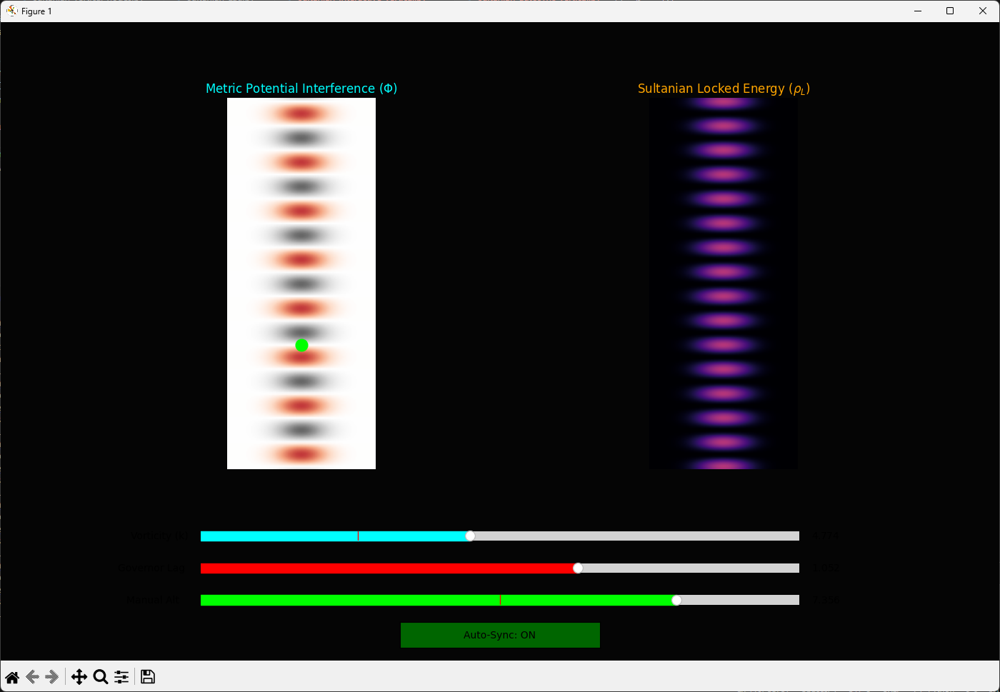
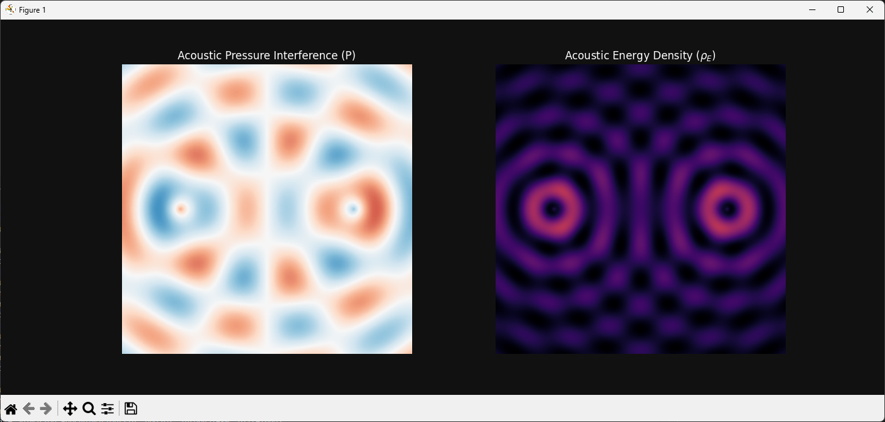

# Sultanian Protocol: Isentropic Ghosting: Leveraging 5.2 THz Metric Cancellation for Propellantless Propulsion
# Sultanian Protocol: 5.2 THz Metric Cancellation Simulation

A computational suite for simulating the Acoustic-Metric Analogue within the Sultanian Protocol. This project demonstrates the navigation of high-vorticity vacuum environments (singularities) by creating isentropic "Ghost States" via 5.2 THz phased metric nulling.

🌌 **Overview**

The Sultanian Protocol treats the vacuum plenum as a pressurized fluid. By emitting high-frequency metric pulses at the 5.2 THz Governor Limit, we can create destructive interference patterns (Null Zones).

**The Goal:** Unlocking the energy density of the vacuum ($\rho_L$) to create a potential gradient for propellantless motion.

**The Challenge:** Maintaining the Alexander Space-Constraint—if processing lag exceeds the vorticity gradient, the vessel experiences a catastrophic Hammer Blow.

🚀 **Key Features**

- Interactive Governor Dashboard: Real-time manipulation of Vorticity ($k$), Governor Lag, and Altitude.
- Dual-View Visualization: Simultaneously track Metric Potential ($\Phi$) and Locked Energy Density ($\rho_L$).
- Stress-Test Analysis: Automated scripts to find the hardware failure ceiling of the 5.2 THz limit.
- Acoustic Mapping: A macroscopic analogue bridging sound pressure levels ($L_p$) to Metric Tension ($\mathcal{T}_\mu$).

🛠️ **Calibration & Theory**

The simulation maps digital "Decibel" levels to astronomical G-forces.

| Sim Output ($L_p$) | G-Force Equiv. | Operational State           |
|--------------------|---------------|-----------------------------|
| 60 dB              | 1.0 G         | Standard Transit             |
| 140 dB             | 1,000 G       | High-Vorticity Manifold      |
| Lag > 0.02         | Critical      | Hammer Blow (Failure)        |



📊 **Simulation Results**

1. **The Stable Corridor**
   - When Auto-Sync is enabled, the Governor maintains the vessel (green drone) within the isentropic nulls of the vertical column.
2. **The Hammer Blow (Decoherence)**
   - When processing latency is introduced, the phase-lock breaks. This visualization captures the transition into a decoherence state where the vessel is exposed to raw metric resistance.

💻 **Getting Started**

**Prerequisites**
- Python 3.10+
- numpy, matplotlib, scipy

**Installation**

```bash
git clone https://github.com/your-username/sultanian-protocol.git
cd sultanian-protocol
pip install -r requirements.txt
```

**Running the Simulation**

```bash
python sultanian_governor_ui.py
```

📚 **Documentation**

For the full mathematical proof and nomenclature, see the LaTeX documentation included in the `/docs` folder.

---

## Folder Structure

- `code/` — Main Python scripts for simulations and analysis:
  - `acoustic_cancellation_sim.py`
  - `sultanian_autosync_vertical.py`
  - `sultanian_hammer_blow_sim.py`
  - `sultanian_interactive_vertical.py`
  - `sultanian_Lag.py`
  - `sultanian_vertical_nodes.py`
  - `vertical_levitation_sim.py`
- `documents/` — LaTeX and auxiliary files for project documentation:
  - `The Acoustic-Metric Equivalence.tex`
  - `The Acoustic-Metric Equivalence.aux`
- `images/` — Placeholder for project images and figures.
- `video/` — Placeholder for project videos and demonstrations.

## License

Specify your license here (e.g., MIT, GPL, etc.).

---

For questions or contributions, please open an issue or pull request.
